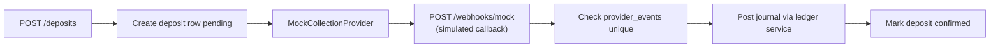
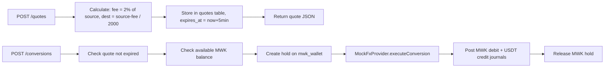
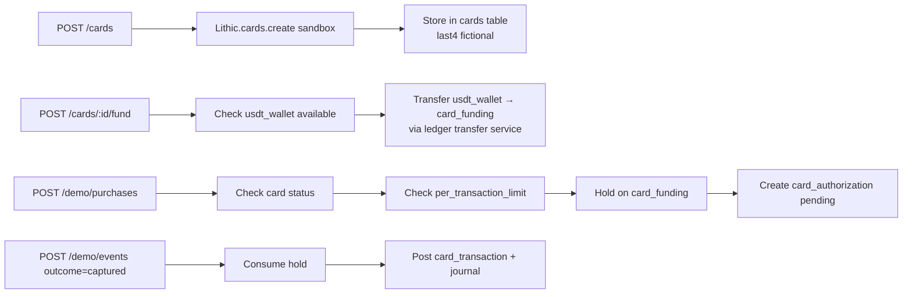
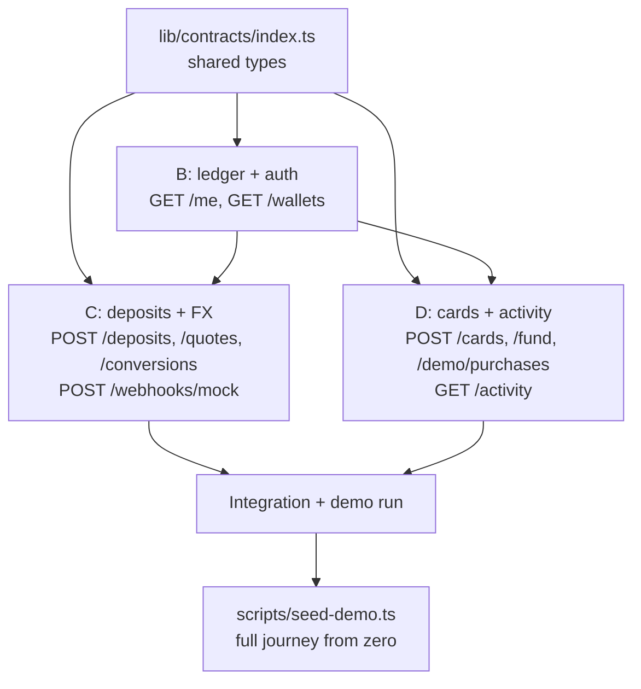

# LAD Transfer — Backend API and Integration Plan

3 backend people. Work is split into three workstreams that can proceed in parallel once the shared foundation is done. All routes live under `app/api/v1/`. All domain logic lives in `lib/server/`. Frontend talks only to the API routes — never to `lib/server/` directly.

---

## Shared foundation — do this first, together (30 min)

Fill [`lib/contracts/index.ts`](lib/contracts/index.ts) with the agreed types. Every backend route and every frontend component references these. No one invents their own shape.

### ISO 4217 currency standard

ISO 4217 defines a minor-unit exponent — the number of decimal places between the major unit and its smallest sub-unit. Store all amounts as integers in the minor unit, transmit as strings in JSON. Use `BigInt` in TypeScript; never `Number` for money.

| Currency | ISO code | Exponent | Minor unit | 1 major = N minor |
|---|---|---|---|---|
| Malawian Kwacha | MWK | 2 | tambala | 100 |
| US Dollar | USD | 2 | cent | 100 |
| USDT (on-chain) | — | 6 | micro-USDT | 1,000,000 |

USDT is not ISO 4217. Exponent 6 follows the TRC-20/ERC-20 on-chain convention.

**Demo rule:** the UI accepts whole-kwacha input. The API multiplies ×100 at the boundary before any storage or arithmetic (`amount_tambala = input × 100`). Internal storage is ISO-correct (exponent 2).

### Key types

```ts
// asset includes USD for future-proofing; only MWK and USDT used in demo
type Asset = "MWK" | "USD" | "USDT";

// amount_units = BigInt in minor units (tambala for MWK, micro-USDT for USDT)
// exponent tells the frontend how many decimal places to display
type MoneyAmount = { asset: Asset; amount_units: string; exponent: number }

type WalletBalance = {
  account_id: string; asset: Asset; purpose: string
  posted_units: string; held_units: string; available_units: string
  exponent: number
}

type ApiError = {
  error: { code: ErrorCode; message: string; retryable: boolean }
  request_id: string
}
```

Error codes the frontend will handle: `QUOTE_EXPIRED`, `INSUFFICIENT_FUNDS`, `LIQUIDITY_UNAVAILABLE`, `CARD_FROZEN`, `LIMIT_EXCEEDED`, `VERIFICATION_REQUIRED`, `PROVIDER_PENDING`, `IDEMPOTENCY_CONFLICT`.

HTTP statuses: 400 validation, 401 unauthenticated, 403 forbidden, 404 not found, 409 idempotency conflict, 422 business rule, 202 async accepted.

---

## Workstream B — Core ledger (Person 1)

Everything else depends on this. Do it first.

### Files to create
- `lib/server/ledger/post.ts` — write balanced journal entries inside a Postgres transaction
- `lib/server/ledger/holds.ts` — create, consume, and release holds atomically
- `lib/server/ledger/balances.ts` — query the `account_balances` view
- `lib/server/ledger/transfer.ts` — internal transfer between two user accounts (used for card funding)
- `lib/server/auth.ts` — server-side session check, returns `user_id` or throws 401
- `lib/server/idempotency.ts` — check/store idempotency records for monetary writes

### Ledger rules (enforce in `post.ts`)
- All money is `bigint`. No `number` arithmetic anywhere.
- Every journal must balance per asset: sum of debits = sum of credits.
- Never edit a past entry — compensate with a new journal.
- Lock account rows in a consistent order before posting to prevent deadlocks.

### API routes
- `GET /api/v1/me` — return profile + verification status from `profiles` table
- `GET /api/v1/wallets` — return all user accounts from `account_balances` view

### Helper: account lookup
A function `getUserAccounts(userId)` that returns the user's account IDs by purpose. Used by all other workstreams to know which account to debit/credit.

---

## Workstream C — Deposits and FX (Person 2)

Depends on the ledger service from B. Can start with mock data while B is finishing.

### Deposit flow



- `POST /api/v1/deposits` — create deposit row (`pending`), call `MockCollectionProvider.createDeposit`, return `deposit_id`
- `GET /api/v1/deposits/:id` — ownership check, return status + receipt fields
- `POST /api/v1/webhooks/mock` — persist to `provider_events` first (dedup on `provider + event_id`), then process: credit `collection_clearing` → credit user `mwk_wallet`

### FX / conversion flow



- `POST /api/v1/quotes` — compute server-side at fixed demo rate (2,000 MWK/USDT, 2% fee), store in `quotes`, return quote JSON with `expires_at`
- `POST /api/v1/conversions` — verify expiry + ownership + sufficient `available_units`, place hold, execute via mock, post both asset legs through clearing accounts, mark done
- `GET /api/v1/conversions/:id` — ownership check, return status + linked journal refs

### Files to create
- `lib/server/deposits/service.ts`
- `lib/server/fx/quotes.ts` — rate calculation (integer arithmetic only)
- `lib/server/fx/conversions.ts`
- `lib/server/providers/mock-collection.ts` — `CollectionProvider` interface implementation
- `lib/server/providers/mock-fx.ts` — `FxProvider` interface implementation

### Provider interfaces (define in `lib/server/providers/types.ts`)
```ts
interface CollectionProvider {
  createDeposit(params): Promise<{ provider_reference: string }>
  verifyEvent(payload, headers): boolean
}
interface FxProvider {
  executeConversion(operationId: string, params): Promise<{ status: "completed" | "pending" | "failed" }>
}
```

---

## Workstream D — Cards with Lithic sandbox + Integration (Person 3)

Uses Lithic sandbox for card creation, funding, and authorization/capture events. Depends on ledger service from B.

### Lithic sandbox setup
- Add `LITHIC_API_KEY` (sandbox key) to `.env.local` and `.env.example`
- Install the Lithic SDK: `npm install lithic`
- The Lithic MCP server at `https://docs.lithic.com/mcp` can be added to `.cursor/mcp.json` (no auth needed for docs; add API key for live calls)

### Card flow



### API routes to build
- `POST /api/v1/cards` — call `Lithic.cards.create` in sandbox, store `last4` and `provider_card_id`, link to user's `card_funding` account
- `POST /api/v1/cards/:id/fund` — internal USDT transfer from `usdt_wallet` → `card_funding` via ledger transfer service; requires `Idempotency-Key`
- `PATCH /api/v1/cards/:id` — update `status` (freeze/unfreeze) or `per_transaction_limit_units`; call `Lithic.cards.update` to mirror status in sandbox
- `POST /api/v1/demo/purchases` — simulate a merchant authorization: check frozen + limit, create hold on `card_funding`, create `card_authorization` row, return authorization result
- `POST /api/v1/demo/events` — trigger capture / reversal / deposit-confirm / failure; each path posts the correct ledger entry and transitions the right status
- `GET /api/v1/activity` — paginated list of owned deposits, conversions, and card transactions; cursor-based
- `GET /api/v1/activity/:id` — single receipt with full amounts, fees, timestamps, and status; enforce ownership

### Lithic sandbox webhook (for live card events if needed)
- `POST /api/v1/webhooks/lithic` — verify Lithic signature, persist to `provider_events`, process authorization/capture/reversal events
- For the hackathon demo, `POST /demo/events` can substitute for the real webhook

### Files to create
- `lib/server/cards/service.ts`
- `lib/server/providers/lithic-card.ts` — `CardProvider` implementation wrapping the Lithic SDK
- `lib/server/providers/mock-card.ts` — fallback mock if sandbox is unavailable
- `lib/server/activity/service.ts`
- `scripts/seed-demo.ts` — seed one demo user with MWK balance and pre-confirmed deposit for judging

---

## Failure scenarios — all three must cover their own

| Scenario | Owner | Mechanism |
|---|---|---|
| Duplicate deposit callback | C | `provider_events` unique constraint; return 200 without reposting |
| Two simultaneous conversions overdraw | C | Hold placed before checking balance; Postgres row lock on account |
| Quote expired | C | Check `expires_at` before accepting; return `QUOTE_EXPIRED` 422 |
| Liquidity unavailable | C | Check `liquidity_pools.total - reserved > destination_units`; return `LIQUIDITY_UNAVAILABLE` 422 |
| Card frozen | D | Check `cards.status = 'active'`; return `CARD_FROZEN` 422 |
| Auth then capture — no double debit | D | Capture consumes hold, posts one debit; duplicate capture blocked by `card_transactions.provider_reference` unique |
| Cross-user receipt access | B | All routes check `user_id = auth.uid()` before returning |

---

## Build order



---

## Key constraints (enforce everywhere)
- Never `Number` for money — use `BigInt` in server code, return as `string` in JSON
- ISO 4217 minor units — store MWK as tambala (×100), USDT as micro-USDT (×1,000,000); include `exponent` in every JSON money object
- UI input conversion — multiply whole-kwacha input ×100 at the API boundary before any storage or arithmetic
- Every monetary write route requires an `Idempotency-Key` header
- All routes derive `user_id` from the server-side Supabase session — never trust a client-supplied ID
- Use the service role Supabase client in all `lib/server/` code, never the anon client
