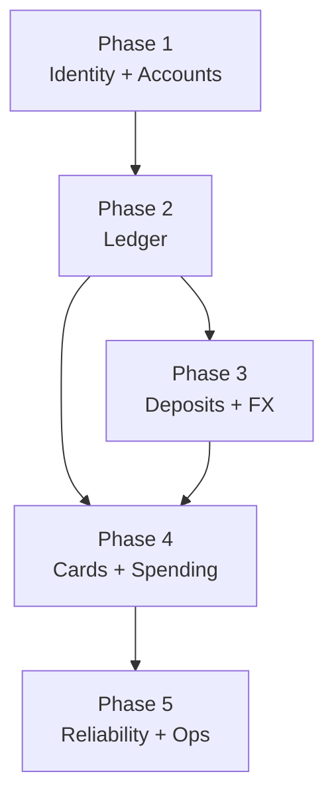

# LAD Transfer — Database Schema Phases

The brief (line 1) already reads "Proposed hackathon build" — no change needed there.

All tables live in Supabase (PostgreSQL). Every table uses UUIDs and UTC timestamps. Money is stored as `bigint` integer units (MWK scale 0, USDT scale 6). No floating-point money anywhere.

---

## Phase 1 — Identity and accounts (foundation, nothing else works without this)

These tables must exist before any API route runs.

- **`profiles`** — one row per auth user; links Supabase Auth `auth.users` to app-level data
  - `user_id` (FK → `auth.users`), `display_name`, `verification_status` (enum: `unverified | pending | verified`), `role` (enum: `user | operator`), timestamps
- **`accounts`** — every wallet and system clearing account
  - `id`, `owner_user_id` (nullable for system accounts), `purpose` (enum: `mwk_wallet | usdt_wallet | card_funding | collection_clearing | fx_clearing_mwk | fx_clearing_usdt | fee_revenue | liquidity_inventory`), `asset` (enum: `MWK | USDT`), `status` (enum: `active | frozen`), timestamps
  - Unique constraint on `(owner_user_id, purpose, asset)`

---

## Phase 2 — Ledger (core money engine)

Required before any money can move. Deposit, FX, and card workstreams all depend on these.

- **`journals`** — one row per financial event (deposit credit, conversion, card debit, fee, etc.)
  - `id`, `operation_id` (links to the business operation that created it), `type` (enum: `deposit | conversion | card_fund | card_auth | card_capture | card_reversal | refund | fee`), `status` (enum: `posted | reversed`), `reversal_of` (self-FK, nullable), timestamps
- **`journal_entries`** — double-entry rows; every journal must balance per asset
  - `id`, `journal_id` (FK), `account_id` (FK), `asset`, `debit_units bigint`, `credit_units bigint`
  - Check: `debit_units >= 0 AND credit_units >= 0`
- **`holds`** — temporary balance reservations (conversions, card authorizations)
  - `id`, `account_id` (FK), `operation_id`, `amount_units bigint`, `status` (enum: `active | consumed | released | expired`), `expires_at`, timestamps
  - Unique constraint on `(account_id, operation_id)`

---

## Phase 3 — Deposits and FX

Needed for the vertical slice: MWK deposit → USDT conversion.

- **`deposits`** — tracks each deposit attempt
  - `id`, `user_id`, `method` (enum: `mobile_money | bank_transfer`), `amount_units bigint`, `asset` (always `MWK` for now), `provider`, `provider_reference`, `status` (enum: `pending | confirmed | failed`), timestamps
- **`quotes`** — server-generated FX quotes; immutable once created
  - `id`, `user_id`, `pair` (e.g. `MWK_USDT`), `source_units bigint`, `fee_units bigint`, `destination_units bigint`, `rate_string` (text, e.g. `"2000"`), `expires_at`, `provider`, `rounding` (text), timestamps
- **`conversions`** — one row per accepted quote
  - `id`, `user_id`, `quote_id` (FK, unique — quote consumed at most once), `status` (enum: `pending | completed | failed`), `provider_reference`, `failure_code`, timestamps
- **`liquidity_pools`** — simulated USDT inventory for the mock FX provider
  - `id`, `provider`, `asset`, `total_units bigint`, `reserved_units bigint`

---

## Phase 4 — Cards and spending

Needed for the second half of the demo journey.

- **`cards`** — virtual demo card per user
  - `id`, `user_id`, `funding_account_id` (FK → `accounts`), `provider_card_id`, `last4`, `status` (enum: `active | frozen | closed`), `per_transaction_limit_units bigint nullable`, timestamps
- **`card_authorizations`** — hold placed when a merchant authorizes a charge
  - `id`, `card_id` (FK), `provider_reference` (unique), `merchant`, `usdt_amount_units bigint`, `status` (enum: `pending | captured | reversed | expired`), `hold_id` (FK → `holds`), `merchant_amount_units bigint nullable`, `merchant_currency text nullable`, timestamps
- **`card_transactions`** — posted debits and credits (captures, reversals, refunds)
  - `id`, `authorization_id` (FK), `type` (enum: `capture | reversal | refund`), `usdt_amount_units bigint`, `provider_reference` (unique), `journal_id` (FK → `journals`), `fee_units bigint nullable`, timestamps

---

## Phase 5 — Reliability and operations

Add these after the core journey works. They prevent duplicate-event bugs and give the ops panel its data.

- **`provider_events`** — raw inbound webhook events; deduplicated before processing
  - `provider`, `event_id`, `payload jsonb`, `status` (enum: `pending | processed | failed`), `attempts int`, timestamps
  - Unique constraint on `(provider, event_id)`
- **`idempotency_records`** — prevents duplicate API writes
  - `user_id`, `route`, `key`, `request_hash`, `operation_id`, `response jsonb`, timestamps
  - Unique constraint on `(user_id, route, key)`
- **`outbox_jobs`** — retry queue for provider calls
  - `id`, `operation_id`, `job_type`, `status` (enum: `pending | running | done | failed`), `attempts int`, `next_attempt_at`, timestamps
- **`audit_events`** — append-only log; never update or delete rows
  - `id`, `actor_id`, `action`, `target_id`, `correlation_id`, timestamps

---

## Dependency flow

---

## Notes

- Supabase RLS policies belong alongside each phase's migration — lock financial tables to service-role only; profiles readable by the owning user.
- System accounts (clearing, fee revenue, liquidity) are seeded in the Phase 1 migration, not created at runtime.
- `package-lock.json` already pins Next.js 16.3.3 — pin Supabase client version the same way once it is added.
