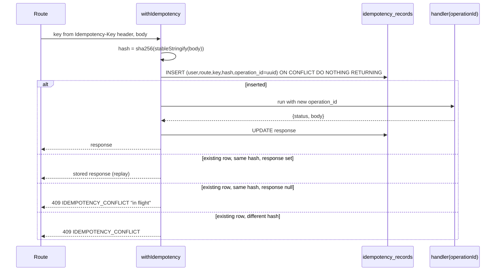

# Workstream B — Core Ledger (Person 1)

## Key decisions

- **Atomicity lives in Postgres.** `@supabase/supabase-js` cannot run multi-statement transactions, so every monetary write (post journal, place/consume/release hold) is a `plpgsql` function called via `supabase.rpc()`. This is what the brief already prescribes ("transactional database functions") and gives us `SELECT ... FOR UPDATE` row locks, per-asset balance checks, and rollback for free. TS modules validate first (fail fast) and then delegate; the SQL function is the source of truth.
- **Server modules use a service-role client**, never the anon/cookie client. RLS on `journals`, `journal_entries`, `holds`, `idempotency_records` is deny-all for clients; only `lib/server/**` touches them. Ledger functions get `REVOKE EXECUTE FROM anon, authenticated` so the browser cannot call them.
- **Money crosses the RPC boundary as strings.** Entries go in as `jsonb` with `"debit_units": "2040000000"`; the `account_balances` view is recreated with `::text` casts so PostgREST never hands us a JSON number for a balance. TS parses with `parseMinorUnits` from [lib/contracts/money.ts](lib/contracts/money.ts).
- **`operation_id` is minted by the idempotency layer**, not the route. A retried request reuses the same `operation_id`, so the DB-level uniqueness (`journals(operation_id, type)`, existing `holds(account_id, operation_id)`) makes a crashed-midway request safe to replay.

## Current state (verified)

- `develop` has `lib/contracts/*` (PR #4) but **no** `lib/supabase/*`, `proxy.ts`, or `@supabase/*` deps — those merged to `main` in PR #3. `git merge-tree origin/develop origin/main` is conflict-free.
- DB already has: `journals`, `journal_entries` (checks `debit_credit_non_negative`, `one_side_only`), `holds` (unique `(account_id, operation_id)`, `amount_positive`), `idempotency_records` (unique `(user_id, route, key)`, columns `request_hash`, `operation_id`, `response jsonb`), `account_balances` view (columns are `numeric` — to be fixed), `handle_new_user` trigger creating the three user accounts.
- Missing: unique index on `journals(operation_id, type)`, all ledger functions, `server-only` package, `SUPABASE_SERVICE_ROLE_KEY`.

## Phase B0 — Base branch prep (30 min)

1. Merge `main` into `develop` (PR "chore: sync auth + supabase clients into develop"), so `develop` has auth, Supabase clients, and contracts together.
2. Branch `feature/core-ledger` off `develop`.
3. `npm i server-only` and `npm i -D vitest`; add `"test": "vitest run"` and `"test:int": "vitest run tests/integration"` scripts.
4. Add `SUPABASE_SERVICE_ROLE_KEY=` to [.env.example](.env.example) (placeholder). **You must paste the real key into `.env.local`** from Supabase Dashboard → Project Settings → API → `service_role` (MCP cannot read it).
5. Read `node_modules/next/dist/docs/01-app/03-api-reference/03-file-conventions/route.md` before writing routes (done: handlers are `export async function GET(request: NextRequest)` returning `Response.json`).

## Phase B1 — Read path: plumbing, `/me`, `/wallets` (half day)

Demo-able on its own: the dashboard can show three zero balances the moment this lands.

- `lib/supabase/admin.ts` — `import "server-only"`; `createAdminClient()` using `SUPABASE_SERVICE_ROLE_KEY`, `auth: { persistSession: false, autoRefreshToken: false }`. Throws at import if the key is missing.
- `lib/server/auth.ts` — `requireUser(): Promise<{ userId: string }>` using the cookie client from [lib/supabase/server.ts](lib/supabase/server.ts) → `auth.getUser()`; throws `ApiHttpError("UNAUTHORIZED")` (401). Also `requireOperator()` (checks `profiles.role = 'operator'`, 403 `FORBIDDEN`) for D's demo routes.
- `lib/server/http.ts` (small addition, not in your list but every route needs it) — `class ApiHttpError extends Error { code: ErrorCode; details? }`, and `route(handler)` wrapper that catches `ApiHttpError` / `MoneyError` / unknown and returns the `ApiError` envelope from [lib/contracts/errors.ts](lib/contracts/errors.ts) with `request_id` (`crypto.randomUUID()`) and the mapped HTTP status. Also a `parseBody(req, schema)` helper (manual field checks → `VALIDATION_ERROR`; no zod to keep deps small).
- `lib/server/ledger/accounts.ts` — the helper you asked for:
  ```ts
  type UserAccountPurpose = "mwk_wallet" | "usdt_wallet" | "card_funding";
  getUserAccounts(userId): Promise<Record<UserAccountPurpose, { id: string; asset: Asset }>>  // throws if any missing
  getSystemAccount(purpose: SystemAccountPurpose, asset: Asset): Promise<{ id: string }>
  assertAccountOwner(accountId, userId): Promise<void>  // 403 FORBIDDEN
  ```
- `lib/server/ledger/balances.ts` — `getWalletBalances(userId): Promise<WalletBalance[]>` and `getAccountBalance(accountId)`; reads `account_balances`, maps to the `WalletBalance` shape in [lib/contracts/index.ts](lib/contracts/index.ts) with `exponent` from `CURRENCY_META`, all units through `parseMinorUnits`.
- `app/api/v1/me/route.ts` — `GET`: `requireUser` → `profiles` select → `MeResponse`.
- `app/api/v1/wallets/route.ts` — `GET`: `requireUser` → `getWalletBalances` → `WalletsResponse`.

## Phase B2 — Transactional ledger in Postgres (half day)

One migration `ledger_functions` applied via Supabase MCP and saved to `supabase/migrations/` in the repo:

- `CREATE UNIQUE INDEX journals_operation_type_uidx ON journals(operation_id, type);`
- Recreate `account_balances` (DROP + CREATE; column types change) with `posted_units`, `held_units`, `available_units` cast `::text`.
- `ledger_available_units(p_account_id uuid) RETURNS bigint` — posted minus active holds, used inside the functions below.
- `ledger_post_journal(p_operation_id uuid, p_type journal_type, p_entries jsonb, p_consume_hold_ids uuid[] DEFAULT '{}', p_reversal_of uuid DEFAULT NULL) RETURNS uuid`
  1. Idempotency short-circuit: if a `journals` row with `(operation_id, type)` exists, return its id.
  2. Validate entries: at least 2; each has `account_id`, `asset`, string `debit_units`/`credit_units` castable to bigint; exactly one side > 0; `asset` equals the account's asset.
  3. Per-asset balance: `SUM(debit) = SUM(credit)` grouped by asset, else `RAISE 'LEDGER_UNBALANCED'`.
  4. **Lock in consistent order**: `SELECT id FROM accounts WHERE id = ANY(ids) ORDER BY id FOR UPDATE` (prevents deadlocks between concurrent transfers touching the same pair).
  5. Mark `p_consume_hold_ids` `active → consumed` (must belong to a debited account in this journal, else `HOLD_NOT_ACTIVE`).
  6. Insert `journals` + `journal_entries`.
  7. For every **user-owned** account net-debited in this journal, assert `ledger_available_units(id) >= 0`, else `RAISE 'INSUFFICIENT_FUNDS'`. System accounts (clearing, revenue, treasury) may go negative — that is normal double-entry.
- `ledger_place_hold(p_account_id uuid, p_operation_id uuid, p_amount_units bigint, p_expires_at timestamptz DEFAULT NULL) RETURNS uuid` — lock account row `FOR UPDATE`, existing hold for `(account, operation)` → return it; `amount > available` → `INSUFFICIENT_FUNDS`; insert.
- `ledger_release_hold(p_hold_id uuid) RETURNS void` — `active → released`; already released is a no-op; `consumed` → `HOLD_NOT_ACTIVE`.
- All functions `SECURITY INVOKER`, `REVOKE EXECUTE ... FROM anon, authenticated`. Errors use `RAISE EXCEPTION USING MESSAGE = '<ERROR_CODE>', ERRCODE = 'P0001'` so TS can map the message straight onto `ErrorCode`.

## Phase B3 — Write path in TypeScript (half day)

- `lib/server/ledger/types.ts` — `JournalEntryInput { accountId; asset; debitUnits: bigint; creditUnits: bigint }`, `PostJournalInput`, `LedgerError` (wraps `ErrorCode`).
- `lib/server/ledger/post.ts` — enforces your four rules before calling SQL:
  - `assertBigint` on every unit; any `number` throws `VALIDATION_ERROR` (rule: no number arithmetic).
  - `assertBalanced(entries)` per asset with `bigint` sums; `assertOneSide`.
  - Serialises units to strings, calls `rpc("ledger_post_journal")`, maps `P0001` message → `LedgerError(code)`.
  - `postJournal(input): Promise<{ journalId: string }>`
  - `reverseJournal({ journalId, operationId, type }): Promise<{ journalId }>` — reads the original entries, posts mirrored entries with `reversal_of` (rule: never edit, always compensate).
- `lib/server/ledger/holds.ts` — `placeHold({ accountId, operationId, amountUnits, expiresAt? })`, `releaseHold(holdId)`, `getHold(holdId)`. Consumption is **not** a standalone call: it is `postJournal({ consumeHoldIds })` so capture and consume are one transaction.
- `lib/server/ledger/transfer.ts` — `transferBetweenUserAccounts({ userId, operationId, from: "usdt_wallet", to: "card_funding", amountUnits, type: "card_fund" })`: `getUserAccounts`, assert same asset (`assertSameAsset`), post `[debit from, credit to]`, return `{ journalId, balances: WalletBalance[] }` (shape of `FundCardResponse`).
- `lib/server/idempotency.ts` — `withIdempotency(req, { userId, route }, body, handler)`:



  Missing header on a route listed in `IDEMPOTENT_ROUTES` → 400 `VALIDATION_ERROR`. Hashing via Web Crypto `crypto.subtle.digest` (no Node-only import, works in route handlers).

## Phase B4 — Tests (half day)

Vitest, `tests/` folder per the brief.

**Unit (no DB, run in CI):**
- `tests/unit/ledger-post.test.ts` — balanced journal passes; unbalanced per asset rejected; MWK debit vs USDT credit rejected even if numerically equal; entry with both sides rejected; `number` units rejected; bigint → string serialisation.
- `tests/unit/idempotency-hash.test.ts` — same body with reordered keys hashes identically; different amounts differ.
- `tests/unit/balances-map.test.ts` — view row strings → `WalletBalance` with correct `exponent`; unsafe/non-integer strings rejected.

**Integration (`tests/integration/`, skipped unless `SUPABASE_SERVICE_ROLE_KEY` is set):**
- Setup: `auth.admin.createUser({ email: "ledger-test+<uuid>@ladtransfer-tests.dev", email_confirm: true })` → trigger provisions accounts. Learned in B1: Supabase Auth rejects `.test` and `example.com` addresses outright, and the project has email confirmation ON with the built-in SMTP (rate-limited to a few sends/hour), so test users MUST be created via the admin API with `email_confirm: true` — never through the signup form. Because ledger FKs are `ON DELETE RESTRICT`, test users are not deleted per run; a `scripts/cleanup-test-users.sql` removes `@ladtransfer-tests.dev` users in dependency order (holds → journal_entries → journals → accounts → profiles → auth.users).
- `server-only` is aliased to `tests/stubs/server-only.ts` in `vitest.config.mts` (done in B1) so `lib/server/**` imports work under vitest.
- Scenarios (brief's demo numbers):
  1. Deposit credit 20,400,000 tambala (debit `collection_clearing`, credit `mwk_wallet`) → posted, balance `"2040000000"`? No — `"20400000"`; asserts exact string.
  2. Unbalanced journal rejected by SQL even if TS validation is bypassed (call rpc directly).
  3. Place hold 20 USDT (`20000000`) → `held_units` and `available_units` correct.
  4. **Concurrency**: two `placeHold` calls for 60 USDT each on a 99.96 USDT balance via `Promise.all` → exactly one succeeds, one `INSUFFICIENT_FUNDS`.
  5. Capture: `postJournal({ consumeHoldIds: [h] })` debits once, hold becomes `consumed`, available unchanged from held state.
  6. `releaseHold` restores available; releasing a consumed hold → `HOLD_NOT_ACTIVE`.
  7. `reverseJournal` produces a compensating journal with `reversal_of` set; net balance back to prior.
  8. `transferBetweenUserAccounts` 30 USDT → `usdt_wallet 69.96`, `card_funding 30`; cross-user account id → `FORBIDDEN`.
  9. Idempotency: same key + body twice → identical response and one journal; same key different body → 409.
  10. Replaying `ledger_post_journal` with the same `(operation_id, type)` returns the original journal id, no second journal.
  11. RLS: anon client `select * from journals` returns nothing.

## Phase B5 — Hand-off and PR (1 hr)

- Add "Ledger API for C and D" section to [docs/backend-api-plan.md](docs/backend-api-plan.md) with the exact signatures above and the two rules callers must follow: always go through `withIdempotency` for monetary writes, and never call `rpc('ledger_*')` directly.
- PR `feature/core-ledger → develop` with summary and test output.

## Files touched

- New: `lib/supabase/admin.ts`, `lib/server/auth.ts`, `lib/server/http.ts`, `lib/server/idempotency.ts`, `lib/server/ledger/{types,accounts,balances,post,holds,transfer}.ts`, `app/api/v1/me/route.ts`, `app/api/v1/wallets/route.ts`, `supabase/migrations/<ts>_ledger_functions.sql`, `tests/unit/*`, `tests/integration/*`, `scripts/cleanup-test-users.sql`, `vitest.config.ts`
- Edited: `package.json`, `.env.example`, `docs/backend-api-plan.md`