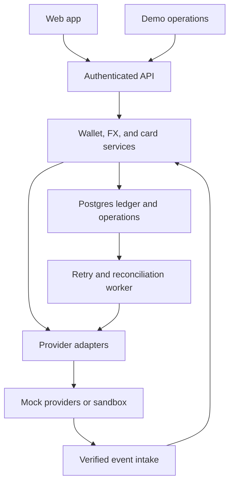

m# Malawi Global Wallet — product and engineering team brief

Version 1.1 • 19 September 2026 • Proposed hackathon build

Working title only. This brief defines a buildable prototype, not an already operating financial service. Team size and deadline are unknown; assignments below use four workstreams that can be combined. Provider selection remains open.

## 1. What we are building

A web app that helps local Malawians use money earned in Malawian kwacha (MWK) for international online purchases. Users deposit MWK, review a quote to convert into USDT, hold a clearly identified balance, and fund a virtual card for spending.

The core user has MWK locally. They do not need to earn foreign currency abroad or receive a diaspora remittance to be our target customer.

Malawi’s foreign-exchange shortage is the context. The World Bank reports official reserves below one month of import cover and foreign-exchange constraints affecting business activity. [World Bank country overview](https://www.worldbank.org/ext/en/country/malawi), accessed 19 September 2026. Our problem hypothesis is that people who can afford a purchase in MWK still encounter forex applications, delays, inadequate allocations, or rejection when trying to pay internationally. Validate those individual experiences through interviews; do not present invented statistics.

Our contribution is an additional, transparent route to international spending when partner liquidity is available. A digital wallet does not create foreign liquidity. Every real MWK-to-USDT conversion requires a counterparty willing and able to deliver the destination asset.

### Product decisions for the team

| Decision | Working agreement |
|---|---|
| Primary audience | Local Malawians with MWK who need to make international online purchases |
| First demo persona | A small business owner paying for a software subscription with a demo cost of 20 USDT |
| Platform | Responsive web app; mobile-friendly screens |
| Funding | Simulated mobile-money collection first; bank transfer as a secondary option |
| Assets | MWK deposit balance and USDT wallet; USDT is the only conversion destination and card-funding asset |
| Card model | USDT-funded virtual demo card with an explicit USDT spending allocation |
| USDT spending | Allocate USDT to card spending; the card partner handles conversion and merchant settlement |
| First complete route | MWK → USDT → card spending allocation → simulated purchase |
| Integrations | Deterministic mock adapters by default; replace individual adapters if a usable sandbox is available |
| Definition of success | A working journey with correct balances, transparent fees, useful failure states, and a repeatable demo |

USDT here means a simulated token balance, not a bank account. The card allocation is an internal USDT balance used for the demo; it does not imply merchants or card networks accept USDT directly. Named bank account details, live deposits, and live cards are outside the prototype unless a partner actually provides them.

## 2. User experience and scope

### Must-have screens

| Screen | User actions | Required behavior |
|---|---|---|
| Welcome and sign-in | Sign up or enter a seeded demo account | Explain purpose; persistent demo indicator |
| Onboarding | Enter basic fictional profile information | Show simulated verification status; collect no real identity documents |
| Dashboard | See wallets, card funds, and recent activity | Asset labels; available and held funds; clear primary actions |
| Add money | Choose deposit method and MWK amount | Pending → confirmed or failed; never credit on button click alone |
| Convert | Enter MWK amount to convert into USDT | Rate direction, fee, amount received, expiry, and confirmation |
| Card | Create card, fund, freeze, unfreeze, set limit | Masked fictional card details; card funding balance distinct from wallets |
| Demo checkout | Choose a sample merchant and simulated USDT debit | Authorization result, pending hold, and capture confirmation |
| Activity and receipt | Open a deposit, conversion, transfer, or purchase | Amounts, assets, fees, reference, timestamp, and status |
| Demo operations | Trigger provider outcomes and reset owned demo scenario | Restricted operator access; liquidity and event visibility |

Show actionable errors: “This quote expired. Get a new quote,” “Not enough USDT liquidity is available,” “Card frozen,” and “Deposit is still pending.” Do not collapse every outcome into “Something went wrong.”

### Scope priority

**P0 — complete first:** authentication, deposit simulation, MWK and USDT wallets, quote acceptance, USDT card funding, card authorization/capture, receipts, duplicate-event protection, and a seeded demo.

**P1 — after P0 integrates:** card freeze, limits, reversal, refund, unavailable-liquidity scenario, and operator event panel.

**Later:** real KYC, real mobile-money or bank collection, custody, live FX execution, card issuing, cross-border withdrawals, native mobile apps, recurring payments, and multiple chains.

Do not spend hackathon time on lending, savings yield, crypto trading charts, peer-to-peer exchange markets, or a remittance product. Those are separate products.

## 3. Demonstration and acceptance criteria

Use fictional rates prominently labeled “Demo rate — not a market quote.” This example uses 2,000 MWK per USDT and a 2% source-currency conversion fee solely to make the arithmetic easy.

1. A user deposits **204,000 MWK**. The wallet remains unchanged while pending; a successful provider event credits it once.
2. The user converts all 204,000 MWK. The fee is **4,080 MWK**, leaving **199,920 MWK** to exchange at 2,000 MWK/USDT. They receive **99.96 USDT**.
3. They transfer **30 USDT** from the USDT wallet to the card funding account. Wallet: **69.96 USDT**; card: **30 USDT**. This is an internal transfer, not an additional deposit.
4. A purchase with a simulated debit of **20 USDT** is authorized. Card posted balance remains **30 USDT**, held balance becomes **20 USDT**, and available balance becomes **10 USDT**.
5. Capture posts the purchase. Card posted balance becomes **10 USDT**, held balance returns to zero, and the USDT wallet stays **69.96 USDT**.
6. Freeze the card and try another purchase. It is declined with a clear reason and no money movement.

For this demo, purchase amounts represent the total simulated USDT debit, with card conversion costs set to zero and labeled accordingly. A live card adapter must retain the original merchant amount and currency, the partner conversion quote and fees, and the resulting USDT debit. It must handle capture adjustments and refunds using provider-confirmed amounts; do not assume merchants receive USDT or that token value is fixed.

### Demo acceptance tests

| Scenario | Pass condition |
|---|---|
| Deposit callback delivered twice | One credit; repeated event acknowledged without a second posting |
| Two simultaneous conversion requests exceed balance | At most the affordable request succeeds; no negative available balance |
| Quote expires | Acceptance rejected with a new-quote action |
| Liquidity unavailable | Conversion not completed; reservation released when failure is confirmed |
| Provider times out | Operation remains pending/unknown; reconcile before retry or releasing money |
| Card frozen or limit exceeded | Decline; no new hold |
| Authorization followed by capture | Hold becomes one purchase debit, not a second debit |
| Authorization reversed | Hold released; no purchase debit |
| Capture event duplicated | One posted purchase |
| Refund after capture | New linked credit; original purchase retained |
| User requests another user’s receipt | Access denied |
| Refresh or sign in again | Same server-backed balances and history |

## 4. Proposed architecture

Use a modular monolith: one web application, one backend, and one database. Modules have clear contracts, but no separate microservices are needed.



### Suggested stack

| Layer | Proposal | Purpose |
|---|---|---|
| UI and API | Next.js with TypeScript | Shared types and one application to integrate |
| Styling | Tailwind CSS | Consistent responsive components |
| Authentication/database | Supabase Auth and PostgreSQL | Sessions, persistent data, transactions, and access policies |
| Domain logic | Server-only TypeScript modules and transactional database functions | Centralize monetary rules |
| Jobs | Database outbox plus a small worker; manual operator trigger acceptable for demo | Recover incomplete provider work |
| Provider calls | Interfaces with mock and optional sandbox implementations | Avoid blocking product development on approvals |
| Deployment | One preview environment plus separate demo database | A shared URL for integration and judging |

This is an implementation proposal, not a requirement to use a particular host. Pin dependencies when initializing the repository. Keep provider keys and privileged database credentials server-side.

### Module boundaries

**Identity:** session validation, ownership, demo verification state, operator role.

**Wallet/ledger:** accounts, postings, holds, balance queries, transfers. Other modules request money movement through this module; they cannot edit a balance directly.

**Deposits:** payment instructions, provider reference, callback processing, deposit lifecycle.

**FX:** quote calculation, expiry, fees, liquidity reservations, conversion execution, confirmation/recovery.

**Cards:** creation, status, card funding, spending limits, authorization, capture, reversal, refund.

**Provider adapters:** normalize external behavior and statuses; contain provider-specific code.

**Operations:** event inbox, failed/pending work, liquidity overview, scenario controls, audit records.

## 5. Money model and ledger rules

The database is authoritative. A front-end state change or a client-supplied “success” cannot create funds.

### ISO 4217 currency reference

ISO 4217 defines a minor-unit exponent for every fiat currency — the number of decimal places between the major unit and its smallest sub-unit. All amounts are stored as integers in the minor unit and transmitted as strings in JSON. Never use floating-point arithmetic for money; use BigInt in TypeScript.

| Currency | ISO code | ISO numeric | Exponent | Minor unit | 1 major unit = N minor units |
|---|---|---|---|---|---|
| Malawian Kwacha | MWK | 454 | 2 | tambala | 100 |
| US Dollar | USD | 840 | 2 | cent | 100 |

USDT is not an ISO 4217 currency. It is a USD-pegged stablecoin. The on-chain convention (TRC-20, ERC-20) uses 6 decimal places: 1 USDT = 1,000,000 units. This project follows that convention internally.

| Token | Standard | Exponent | 1 token = N units |
|---|---|---|---|
| USDT | on-chain (TRC-20 / ERC-20) | 6 | 1,000,000 |

### Demo simplification and production note

The UI accepts whole-kwacha input (e.g. 204,000 MWK). The API layer converts to tambala before any storage or arithmetic: `amount_tambala = input × 100`. Internal storage is therefore ISO-correct (exponent 2) even though the UI hides sub-kwacha precision. This is a product convention for the demo and does not override the ISO standard.

A production integration must accept tambala directly from providers and must not assume whole-kwacha input from external systems. Adapters must translate to actual provider/token precision.

Represent monetary amounts as integer minor units and transmit them as JSON strings. Use exact integer arithmetic (BigInt in TypeScript), never JavaScript floating-point arithmetic for money.

Store a currency on every account and entry. Suggested internal accounts include user MWK/USDT wallets, user USDT card funding, collection clearing, FX clearing per asset, fee revenue per asset, card settlement clearing, and simulated liquidity inventory.

Post immutable balanced journals. For each journal and asset, total debits equal total credits; do not balance MWK against USDT by adding unlike amounts. A conversion links separate balanced source and destination postings through currency-specific clearing accounts. Corrections use compensating entries, never editing past entries.

For user liability accounts, credits increase the user’s balance and debits decrease it. Account type determines the normal balance. A deposit increases the simulated collection asset and the customer liability. Card funding debits the customer’s USDT wallet liability and credits their card funding liability.

**Available balance = posted spendable balance − active holds.** Apply holds to conversion reservations and card authorizations. Move or release holds atomically with the relevant posting. Lock affected account/hold rows in a consistent order inside database transactions, or use an equivalent concurrency-safe strategy.

Keep the wallet and card funding account separate to avoid accidental double spending. A dashboard may show total USDT with separate wallet and card allocations, but must not suggest the same token is spendable in both places. Keep MWK separate from USDT totals.

### FX execution contract

1. Generate a server-side quote containing source amount, fee, rate direction, destination amount, rounding policy, provider, and expiry.
2. On acceptance, verify ownership, expiry, supported pair, sufficient available source balance, and destination liquidity.
3. Atomically create the conversion, reserve source funds and destination inventory, and enqueue execution.
4. Call the adapter with a stable operation ID. Do not hold a database lock across a network request.
5. On confirmed success, post both asset legs and fees, consume reservations, and mark completed in one transaction.
6. On confirmed failure, release reservations and mark failed. On ambiguous timeout, keep pending and query the provider using the original operation ID.

For a mock provider, steps 4–6 can complete immediately but must use the same service methods. A live provider may require a different prefunding/settlement model; the adapter contract is not proof that live integration is solved.

## 6. Data model

| Table | Main fields and constraints |
|---|---|
| profiles | user_id, display_name, verification_status, role; role changes restricted |
| accounts | id, owner_user_id or system_owner, purpose, asset, status; unique user/purpose/asset |
| journals | id, operation_id, type, status, created_at, reversal_of; unique posting reference |
| journal_entries | journal_id, account_id, asset, debit_units, credit_units; balanced posting validation |
| holds | id, account_id, operation_id, amount_units, status, expires_at; unique reservation reference |
| deposits | id, user_id, method, amount_units, asset, provider, provider_reference, status |
| quotes | id, user_id, pair, source_units, fee_units, destination_units, rate_string, expires_at, provider, rounding |
| conversions | id, user_id, quote_id, status, provider_reference, failure_code; quote consumed at most once |
| liquidity_pools | id, provider, asset, total_units, reserved_units; atomic inventory reservations |
| cards | id, user_id, funding_account_id, provider_card_id, last4, status, per_transaction_limit_units |
| card_authorizations | id, card_id, provider_reference, merchant, usdt_amount_units, status, hold_id; optional merchant_amount_units, merchant_currency, settlement_quote_reference |
| card_transactions | id, authorization_id, type, usdt_amount_units, provider_reference, journal_id; optional merchant_amount_units, merchant_currency, fee_units; unique external reference |
| provider_events | provider, event_id, payload, status, attempts; unique provider/event_id |
| idempotency_records | user_id, route, key, request_hash, operation_id, response; unique scope/key |
| outbox_jobs | id, operation_id, job_type, status, attempts, next_attempt_at |
| audit_events | id, actor_id, action, target_id, correlation_id, created_at; append-only |

All operations need created/updated timestamps, ownership where applicable, and explicit statuses. Use UUIDs and UTC timestamps. Activity can be a read model built from operations and journals; do not use a second editable transaction table as a competing source of money truth.

Database policies must restrict user reads to their own records and prevent browser writes to financial tables. Supabase’s RLS documentation explains how grants and row policies work together; privileged service credentials bypass these policies and require server-side ownership checks. [Supabase RLS](https://supabase.com/docs/guides/database/postgres/row-level-security).

## 7. API contracts for parallel work

All paths below are proposed internal endpoints under `/api/v1`. Authenticate every user route and derive user identity from the session. Monetary writes require an `Idempotency-Key`. Reusing a key with a different payload returns a conflict; retries with the same payload return the original operation/result.

| Method and path | Input | Result |
|---|---|---|
| GET /me | Session | Profile and verification state |
| GET /wallets | Session | Asset, posted, held, available balances |
| POST /deposits | method, amount_units, asset=MWK | deposit_id, pending status, simulated instructions |
| GET /deposits/:id | Owned ID | Current status and receipt |
| POST /quotes | source_asset, destination_asset, source_units | Quote with fees, rate, expiry, and destination amount |
| POST /conversions | quote_id | conversion_id and pending/completed status |
| GET /conversions/:id | Owned ID | Outcome and linked journal references |
| POST /cards | Demo cardholder profile reference | Card metadata; fictional masked details |
| POST /cards/:id/fund | USDT amount_units | Transfer operation and updated balances |
| PATCH /cards/:id | status or per_transaction_limit_units | Updated card metadata |
| GET /activity | cursor, optional type | Paginated owned operations |
| GET /activity/:id | Owned ID | Detailed receipt |
| POST /webhooks/:provider | Signed raw provider event | Durable event acknowledgement |
| POST /demo/purchases | card_id, merchant, USDT amount_units | Authorization ID and outcome |
| POST /demo/events | operation_id, outcome | Controlled capture, reversal, deposit or failure event |

Demo mutations require a demo-only server flag and appropriate user/operator authorization. A production build must not expose an unrestricted balance-credit or event-forging endpoint.

Example quote response matching the demo:

```json
{
  "quote_id": "q_demo_01",
  "source": {"asset": "MWK", "amount_units": "204000", "scale": 0},
  "fee": {"asset": "MWK", "amount_units": "4080", "scale": 0},
  "destination": {"asset": "USDT", "amount_units": "99960000", "scale": 6},
  "rate": {"value": "2000", "meaning": "MWK per USDT"},
  "expires_at": "2026-09-19T18:01:00Z",
  "mode": "demo"
}
```

The timestamp is an illustrative fixture; generate fresh expiries at runtime. Frontend displays the server quote and submits only its ID for acceptance. It never computes the authoritative destination credit.

Common error shape: `{ "error": { "code": "QUOTE_EXPIRED", "message": "Get a new quote.", "retryable": true }, "request_id": "..." }`. Other codes include `INSUFFICIENT_FUNDS`, `LIQUIDITY_UNAVAILABLE`, `CARD_FROZEN`, `LIMIT_EXCEEDED`, `VERIFICATION_REQUIRED`, and `PROVIDER_PENDING`. Use consistent HTTP statuses: 400 validation, 401 unauthenticated, 403 forbidden, 404 absent/inaccessible resource, 409 state/idempotency conflict, and 422 business-rule rejection. A pending asynchronous operation can return 202.

## 8. Providers, events, and the card lifecycle

| Adapter | Methods | Default mock behavior |
|---|---|---|
| CollectionProvider | createDeposit, getDepositStatus, verifyEvent | Pending collection followed by success/failure event |
| FxProvider | getQuote, executeConversion, getConversionStatus | Configurable demo rates, inventory, and failure/timeout |
| CardProvider | createCard, setStatus, fundCard, getTransactionStatus | Fictional card plus authorization/capture events |
| CustodyProvider — later | createWallet, getBalance, transfer, getTransferStatus | No chain required for core prototype |

Use an independent mode per adapter: `mock` or `sandbox`. Display what is simulated. A sandbox integration with one component does not make the rest live. No provider has yet been verified for Malawi residency, MWK-to-USDT liquidity, USDT custody, or card issuing.

Persist verified webhook events before processing. Deduplicate on provider/event ID and also enforce unique provider transaction references, since different events can describe the same financial operation. Validate event amount, asset, ownership linkage, and allowed state transitions. Unexpected ordering should trigger deferred processing or a provider status query, not force a backwards status transition.

Card authorization reserves money; capture completes the debit; reversal releases a hold; refund creates a credit after a captured transaction. This separation reflects documented card lifecycles. [Stripe authorization documentation](https://docs.stripe.com/issuing/purchases/authorizations) is a reference for these concepts, not a recommendation or claim of Malawi support.

MVP supports one full capture, one full reversal, and one full refund. Partial captures, incremental authorizations, late presentment, disputes, and multi-currency merchant settlement are later requirements. The mock checkout accepts only simulated USDT debit amounts; merchant-currency settlement is represented by the card adapter.

## 9. Work division and integration order

| Workstream | Owns | Deliverables | Depends on |
|---|---|---|---|
| A — Product/UI | Screen flow, components, wallet/card/receipt views, demo narrative | Responsive screens against shared API fixtures | Shared contracts and error states |
| B — Core backend | Auth, schema, ledger, holds, access policies, idempotency | Transactional money services and balance APIs | Agreed money representation |
| C — Deposits and FX | Collection mock, quotes, liquidity, conversion workflow | Deposit/conversion APIs and event scenarios | Ledger service from B |
| D — Cards and integration | Card mock, checkout, holds/capture, deployment and demo checks | End-to-end purchase journey and repeatable demo | Ledger service and frontend contracts |

With three people, combine C and D and postpone optional features. With five, split deployment/testing/demo operations from D. Assign one named integration owner regardless of team size. Thembi can own scope and pitch if the team agrees; this brief does not assume a mandatory personal assignment.

### First alignment session

Agree on the working name, deadline, owners, P0 route, asset precision, card funding model, statuses, endpoints, and one fixture matching section 3. Create the repository, environment example, shared types, and one schema migration owner. Do not let separate teammates invent different balance formats.

### Build order

1. **Foundation:** shared contracts, authentication, schema, seed data, initial deployed shell.
2. **Vertical slice:** one confirmed deposit through the backend and visible in the UI.
3. **Conversion:** quote, acceptance, ledger postings, and refreshed dashboard.
4. **Spending:** card funding, authorization, capture, and receipt.
5. **Failure cases:** duplicate callback, insufficient funds, expired quote, frozen card, and unavailable liquidity.
6. **Extension:** connect one sandbox or expand operator tools if time remains.
7. **Freeze and rehearse:** fresh-account run, repeatable seed/reset, short demo recording, and final pitch.

For a 24-hour event, a suggested allocation is 2 hours alignment/foundation, 10 hours core build, 5 hours integration, 3 hours failure testing, and 4 hours polish/rehearsal. Scale the proportions to your actual deadline. Merge small changes frequently; reach a deployed full journey before visual polish.

### Suggested repository structure

| Path | Contents / owner |
|---|---|
| app/ | Screens and API routes; A plus relevant API owner |
| components/ | Shared UI; A |
| lib/contracts/ | Shared types and validation schemas; reviewed by all |
| lib/server/ledger/ | Posting, holds, transfers; B |
| lib/server/deposits/ and fx/ | Deposit/conversion services; C |
| lib/server/cards/ | Card domain service; D |
| lib/server/providers/ | Mock/sandbox adapters; C and D |
| supabase/migrations/ | Schema, grants, policies; B coordinates |
| tests/ | Financial invariants and integration scenarios; module owners |
| scripts/ | Demo seed/reset and event fixtures; D |
| docs/ | Setup, contracts, demo script; integration owner |

## 10. Definition of done and remaining decisions

A feature is done when its UI calls the shared backend, state survives refresh, money movement goes through the ledger, errors are understandable, ownership is enforced, and its critical scenario passes. A click-through mockup alone is not completion of a financial flow.

Before judging, demonstrate that repeated callbacks do not mint funds, simultaneous spending cannot overdraw an account, and a card authorization does not double-charge at capture. Include a cross-user access test. These checks address real risks in the proposed implementation.

Use fictional profiles and card numbers, and keep the demo database isolated. Avoid storing real PAN/CVV, identity documents, or private keys. In a later issuer integration, use the issuer’s supported secure card-detail display. For a live launch, resolve custody/safeguarding, partner eligibility, liquidity replenishment, settlement, KYC/AML, applicable permissions, refunds/disputes, and security review with appropriate partners. This document does not establish legal eligibility.

Outstanding decisions: final name; actual team size/deadline; sponsor requirements; whether any usable sandbox is already available; and the primary demo purchase. Default to the choices in section 1 until the team explicitly changes them.

**Team agreement:** build one complete, honest, repeatable journey that turns a simulated local MWK deposit into international purchasing ability, with every balance movement explainable.
